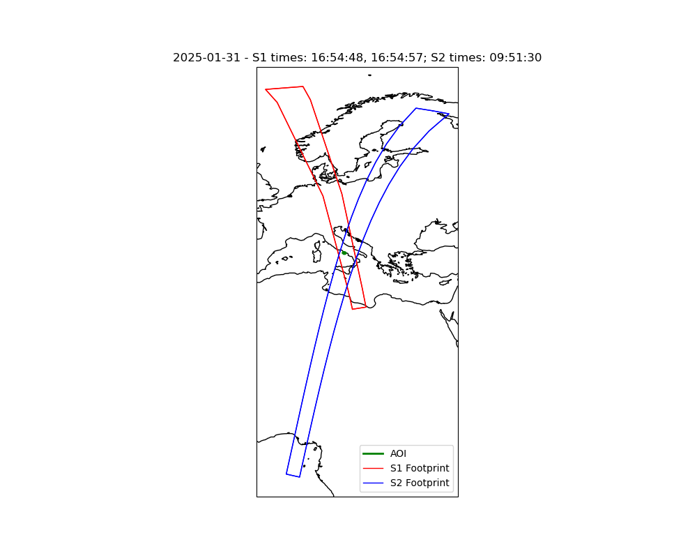

# InterAP_S1S2
A simple python application for finding dates of simultaneous coverage of an AOI between two observing platforms. The repository is currently setup to find intersections between the acquisition plans of Sentinel-1 and Sentinel-2, but the principle can be extended to work with any kml file. 

At the time of writing (14/02/2025), the operational platforms for S1 and S2 are S1A, S2A, S2B, and S2C. The corresponding acquisition plans are openly distributed by the ESA under Copernicus at the following links:
- https://sentinel.esa.int/web/sentinel/copernicus/sentinel-1/acquisition-plans
- https://sentinels.copernicus.eu/web/sentinel/copernicus/sentinel-2/acquisition-plans

## Overview

The project consists of two main parts:

1. **Acquisition Processing and Visualization**  
   The main script (e.g., `intersect_acquisition_plans.py`) performs the following:
   - **Parsing KML Files:** Uses XML parsing to extract acquisition times and footprint geometries from Sentinel-1 and Sentinel-2 KML files.
   - **Filtering by AOI:** Only acquisitions that intersect a specified AOI (provided as a list of coordinates) are considered.
   - **Grouping by Date:** Acquisitions are grouped by day (year-month-day), and duplicate footprints on the same day are removed.
   - **Visualization:** For every day that has both Sentinel-1A and Sentinel-2 acquisitions, a plot is created using Cartopy. The AOI is shown in black, Sentinel-1 footprints in red, and Sentinel-2 footprints in blue. The plot title includes the date and the acquisition times.
   - **Occurrence Data Extraction:** Occurrences (dates with both sensor acquisitions) are saved along with the observed times and the number of days elapsed since the previous occurrence. This information is saved as a CSV file for later use.

2. **Extrapolation of Future Observations**  
   The script `extrapolate.py` uses a simple algorithm to extrapolate future observation dates based on observed time patterns and day increments. It adds the specified number of days to a start date and rotates through the time patterns and day increments to generate a sequence of future dates with observation times. The extrapolated entries are printed and can be used to plan future data acquisitions.

## Required Packages

Before running the scripts, ensure you have the following packages installed:

- Python 3.7 or later
- [Shapely](https://pypi.org/project/Shapely/)  
- [Matplotlib](https://pypi.org/project/matplotlib/)
- [Cartopy](https://pypi.org/project/Cartopy/)
- [Pandas](https://pypi.org/project/pandas/)
- (Optional) [GeoPandas](https://pypi.org/project/geopandas/) if you later decide to integrate file I/O based on geospatial formats
- (Optional) [Fiona](https://pypi.org/project/Fiona/) if you wish to use GeoPandas’ file reading functions

You can install the required packages using pip:

```bash
pip install shapely matplotlib cartopy pandas
```

If you use Conda, you might consider installing the packages as follows:

```bash
conda install -c conda-forge cartopy
```

## Directory Structure
A typical directory structure might look like this:

```bash
project/
├── S1A/              # Folder containing Sentinel-1A KML files
├── S2A/              # Folder containing Sentinel-2A KML files
├── S2B/              # Folder containing Sentinel-2B KML files
├── S2C/              # Folder containing Sentinel-2C KML files
├── intersect_acquisition_plans.ipynb  # Jupiter notebook for the main processing and visualization
├── extrapolate.py    # Script to extrapolate future observation dates
├── occurrences.csv   # Generated by intersect_acquisitions_plans.ipynb.
├── README.md         # This file
└── LICENSE
```

The platform Acquisition Plans folders are loaded with some .kmls for reference. 

## Usage
### Processing and Visualization
#### Set up your AOI
In intersect_acquisition_plans.py, modify the aoi_coords list to match the coordinates of your area of interest (AOI).

#### Set the Base Directory
Change the base_dir variable to point to the directory containing your sensor subfolders (S1A, S2A, S2B, S2C).

#### Run the Script
The Jupyter Notebook will generate Cartopy plots for each day where both Sentinel-1A and Sentinel-2 acquisitions exist and will save a CSV file (e.g., occurrences.csv) containing:

- Date of occurrence
- Observation times for S1 and S2 (as comma-separated strings)
- Days elapsed since the previous occurrence



### Extrapolating Future Observations
The extrapolate.py script uses historical observation intervals and time patterns to extrapolate future acquisition dates. The script is structured as follows:

- Starting Point: 
    The script sets an initial date and a list of observed time patterns (e.g., "05:03:07", "16:54:46", etc.).

- Day Increments:
    A list of observed day increments (e.g., [5, 13, 5, 7, ...]) is used to add to the start date.

- Extrapolation Loop:
    The script adds the day increment to the start date and rotates through the time patterns and day increments, printing the extrapolated entries until a specified end date is reached.

To run the extrapolation script:
```bash
python extrapolate.py
```

The script will print the extrapolated entries in the format:
```bash
YYYY | MM | DD | HH:MM:SS
```

## Contributing
Feel free to fork this repository and submit pull requests for improvements or additional features.

## License
This project is released under the MIT License. See the LICENSE file for details.